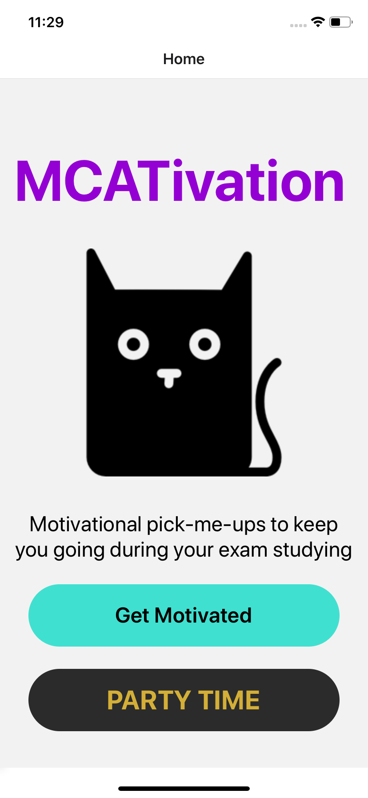
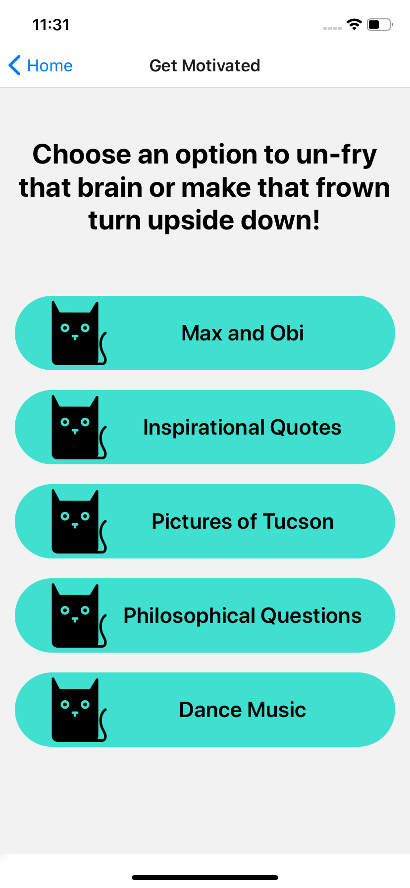
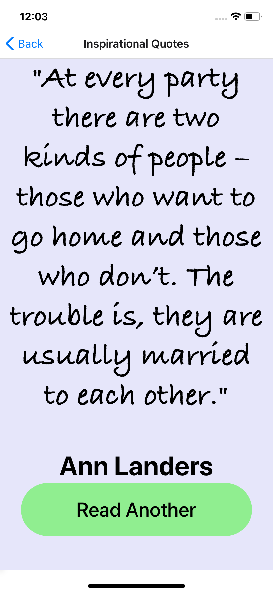

# bdog-xmas-2020 (aka MCATivation)

This app is my first full development of a mobile application using React Native. I've been curious about cross-platform development tools for a while now and have been looking for opportunities to try them out and learn more. I've used React extensively professional settings and React Native was the best choice as an entry point to progress quickly. 

This repo uses the most recent version of React Native and the development code is written in TypeScript:
- [React Native documentation](https://reactnative.dev/docs/getting-started)
- [TypeScript guides and introduction](https://www.typescriptlang.org/docs)

React Native doesn't require TypeScript for typing. It includes support for [Flow](https://flow.org/) without any additional installation. I have extensive experience with TypeScript, though, so I opted to use that instead. The syntax betwee the two is highly similar so it's likely you could switch between the two easily if you have a good awareness of syntactical differences or use a good linter during development.

## The Project

My significant other is preparing for the MCAT. As part of our holiday gifts to one another we agreed to include at least one "craft" item that we made ourselves. I thought building a simple app would be an interactive way to bring inspiration, stress-relief and humor during an intense period of studies. The app maintains various screens for images of pets and pretty places, inspirational quotes and music.

## Challenges and Tips

I found working with React Native to be relatively painless. If you've had experience working with React the development of individual screens and their stylings should come easily. 

The root library itself lacks some functionality that I thought would be included as a default. Navigation and screen flow are two key examples of this. Most popular apps have multiple screens that users move between using buttons, swiping or other gestures. Building an app in React Native requires additional React Native libraries to be imported for navigation (`@react-navigation/native` and `@react-navigation/stack`). Navigation and stack logic and syntax in React Native is very similar to React's routing scheme, so I was able to develop an understanding quickly and implement the screen flow.

## Installation and deployment

In the unlikely event that:
1. someone visits this project, AND 
2. you find it interesting enough to want to run it locally
clone the project repo and run `npm install && npx react-native start`. Your terminal will boot up the program. Setting up an emulator or mobile device can require a bit more work so I recommend refering React Native's device setup instructions [here](https://reactnative.dev/docs/environment-setup).

The code for this repo was developed and tested exclusively on iOS simulators and devices, but should work equally well for Android. For iOS users, once XCode is properly installed with all the expected tools, running `npx react-native run-ios` should deploy the app and you'll be able to interact with it.